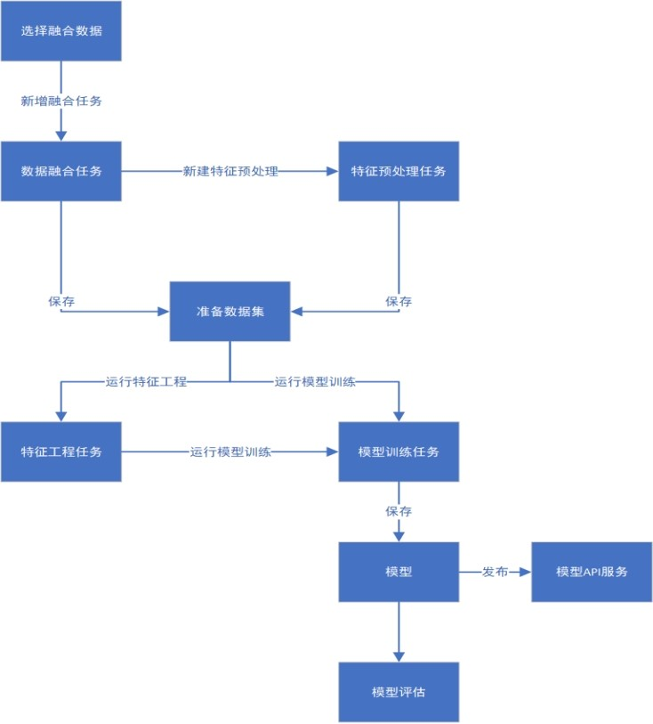

.. SeceumFL documentation master file, created by
   sphinx-quickstart on Tue Jun  6 03:14:06 2023.
   You can adapt this file completely to your liking, but it should at least
   contain the root `toctree` directive.

欢迎使用SeceumFL联邦学习系统
====================================

.. toctree::
   :maxdepth: 2
   :caption: Contents:

产品介绍
==================

SeceumFL联邦学习系统是神谱科技自主研发的隐私计算系列产品，SeceumFL 3.2版本具备了安全隔离域、可信计算、联邦建模等技术能力，有效保障数据安全和用户隐私，支持多方数据安全融合及建模计算，提供从模型训练、评估到应用部署的全流程服务。系统应用模式有助于打破数据孤岛，实现数据价值的充分流动，同时通过可视化效果呈现给用户，便于用户实际操作。    

本手册从系统用户的不同角色出发，介绍整个系统的完整流程。如有任何疑问，请联系`神谱科技公司`_ 客户服务人员。

.. _神谱科技公司: http://www.seceum.com/

快速入门
==================
