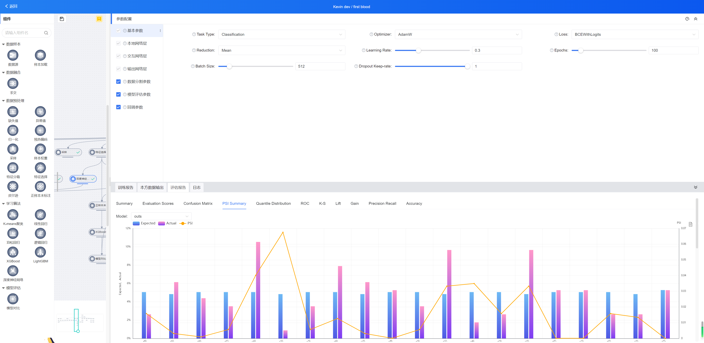

欢迎使用SeceumFL联邦学习系统
====================================

.. toctree::
   :maxdepth: 2
   :caption: Contents:
   快速入门
     部署安装
     登录系统
     数据上传和授权
     训练模型
   各个模块详细说明
   

产品介绍
==================

**SeceumFL** 联邦学习系统是神谱科技自主研发的隐私计算系列产品， **SeceumFL** 具备了安全隔离域、可信计算、联邦建模等技术能力，有效保障数据安全和用户隐私，支持多方数据安全融合及建模计算，提供从模型训练、评估到应用部署的全流程服务。系统应用模式有助于打破数据孤岛，实现数据价值的充分流动，同时通过可视化效果呈现给用户，便于用户实际操作。    

本手册从系统用户的不同角色出发，介绍整个系统的完整流程。如有任何疑问，请联系 神谱科技公司_ 客户服务人员。

.. note::
  - **横向联邦学习**的名称来源于训练数据的“横向划分”，也就是数据矩阵或者表格的按行（横向）划分。不同行的数据有相同的数据特征，即数据特征是对齐的。

  - **纵向联邦学习**的名称来源于训练数据的“纵向划分”，也就是数据矩阵或者表格的按列（纵向）划分。不同列的数据有相同的样本ID，即训练样本是对齐的。
  
  - **发起方**为数据使用方，在纵向联邦学习任务中，它的数据需要带有标签列。
 
  - **参与方**为数据提供方，在纵向联邦学习任务中，通常比发起方有更多的特征。

.. _神谱科技公司: http://www.seceum.com/

--------------

快速入门
==================
部署安装_
^^^^^^^^^^^^^

.. _部署安装: https://github.com/Seceum/SeceumFL/blob/main/%E9%83%A8%E7%BD%B2%E8%AF%B4%E6%98%8E%E6%96%87%E6%A1%A3.md

--------------

登录系统
^^^^^^^^^^^^^

.. image:: ../images/login.png
   :align: center

.. hint:: 系统登录默认用户名和密码都是admin

登录后首先需查看**合作节点是否已经登记**在系统中，请进入**系统管理 节点管理**查看，然后点击列表中的**测试**，如下图：  

.. image:: ../images/node_test.png
   :align: center

--------------

数据上传和授权
^^^^^^^^^^^^^

.. important:: 数据上传涉及到所有的合作节点，所有节点都需要按以下步骤上传数据。    

.. hint:: 测试数据可以用系统自带的 examples_ 里面的csv。    

1. 进入**数据资产.自有数据**，点击**“新建样本”**；
2. 我们可以先尝试简单的数据格式，选择**“数据源类型”**为*“本地文件”*；如：发起方选择*breast_hetero_guest.csv*，合作方选择*breast_hetero_host.csv*；
3. 下一步会来到样本标注，这里的重点是在于一定要确认“标签列”也就是**Y**列；
4. 到这一步我们已经完成了数据的上传，在列表页面点击**“上线”**后才能让合作方在**数据资产.外部数据**列表中看见，点击**“申请授权”**；
5. 合作方进入系统，在**数据资产.授权审批**列表中可以看见刚才的申请，点击“同意”后，可以对数据的用法用量给予限制；

.. admonition:: 为什么看不见对方数据？    
   :class: hint

   如果合作方上传了数据，但在**数据资产.外部数据**列表中看不见，可能存在两种情况。   
       1. 对方数据没有在列表中点击**“上线”**；
       2. 两方系统并没有联通，进入**系统管理.节点管理**查看是否能看到对方节点，查看部署文档确认是否通过测试；

.. _examples: https://github.com/Seceum/SeceumFL/tree/main/examples/data
--------------

训练模型
^^^^^^^^^^^^^

系统以**项目、任务、算法组件**来组织模型的训练，请先完成以下流程：

1. 进入**项目管理.我方发起**，点击“新建项目”后，选择项目参与的合作方和参与人员。
2. 进入“项目详情”，点击“新建任务”，以“纵向建模”任务为例。
3. 在任务列表选择新建的任务，点击“进入任务”，来到画布编辑。
4. 在画布中，左边列出了所有可以用到的算法组件，主要分为三类，数据样本、数据处理和学习算法。把组件拖到画布并连线即可实现模型训练的数据流。
5. 点击每个画布中的组件，可以配置组件所需参数；右键组件后点击“仅执行当前”或“从此处执行”开始组件的运行；运行完成后，点击组件可以查看组件运行后产出的报告和数据。

--------------
