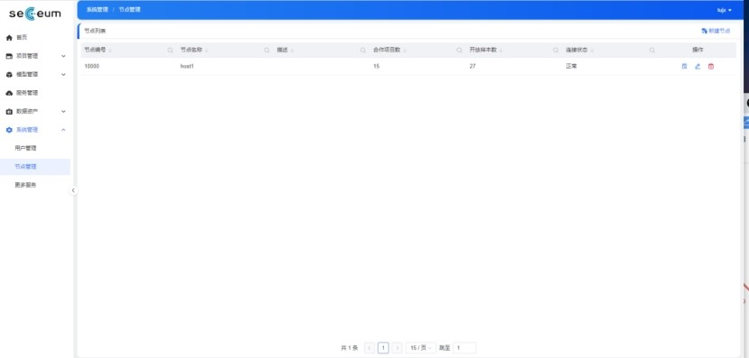
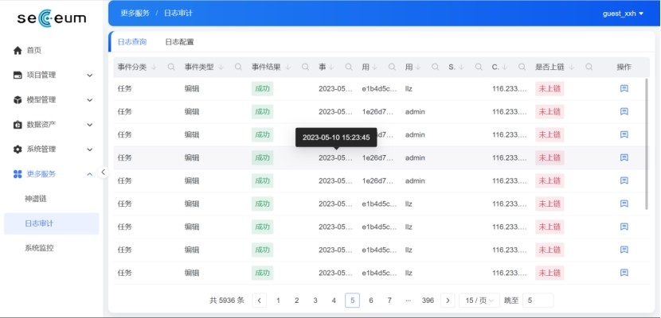
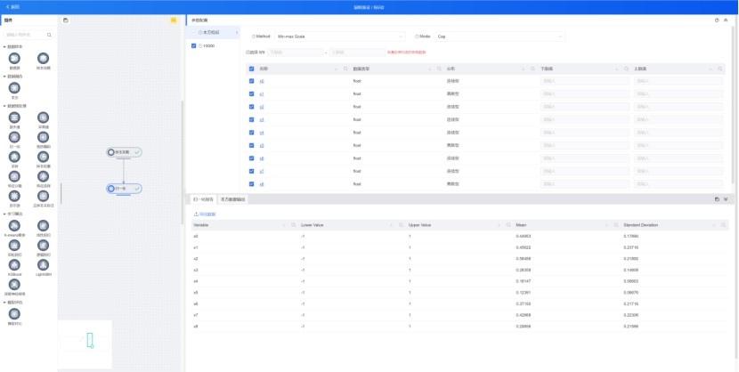
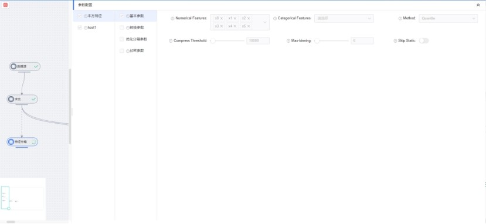
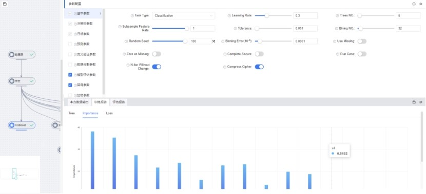

各模块详细说明
====================================
.. toctree::
   :maxdepth: 2
   :caption: Contents:


1	系统管理
-------------------

1.1	用户登录
````````````````

.. admonition:: 操作详情
   :class: note

   1、分别输入「登录名」、「密码」；
   
   2、点击「登录」。


.. image:: ../images/login.png
   :align: center
    图 4：登录


1.2	密码修改
````````````````

.. admonition:: 操作详情
   :class: note
    1、用户登录SeceumFL系统；
    2、选择用户名，点击「账号设置」；
    3、按照提示输入相应密码信息，点击「保存」。
 

    图 5：密码修改


1.3	用户管理
````````````````

登录管理员账号，可以对用户信息，项目信息进行新建，编辑。

.. admonition:: 操作详情
   :class: note
    1、用户登录SeceumFL系统；
    2、点击「系统管理」中的 [用户管理]；
    3、完成用户的编辑与新建；


    图 6：用户管理


    图 7：新建用户


    图 8：编辑用户
 
1.4	角色管理
````````````````

登录管理员账号，可以新建角色，编辑角色。

.. admonition:: 操作详情
   :class: note
    1、用户登录SeceumFL系统；
    2、点击「系统管理」中的 [角色管理]；


    图 9：权限配置
 
1.5	节点管理
````````````````

登录管理员账号，查看节点信息，编辑节点，测试节点。


    图 11：节点管理

.. image:: ../images/node_norm.jpg
   :align: center
    图 12：节点连接正常
 
 
1.6	更多服务
````````````````
1.6.1	日志审计
''''''''''''''''''''''''''''''''

对于系统中的关键动作，Admin可以选择其中某些或者全部动作记录下来以供日后审计，或记录上链。


    图 15：日志审计
 
1.6.2	系统监控
''''''''''''''''''''''''''''''''

本模块是基于Prometheus构建的节点资源监控服务系统。同时，还提供了Grafana看板和告警服务，具备如下功能：
  - 多维度数据模型：每个时间序列都由度量指标和多个标签键值对确定
  - 查询语言：提供灵活的查询语言promQL，对收集的时序数据重组
  - 可视化：数据可视化功能，除了内置的浏览器并与Grafana集成
  - 高效存储：内存加本地磁盘，可通过功能分片和联盟来拓展性能
  - 运维简单：只依赖于本地磁盘，GO二进制安装包没有任何其他依赖
  - 精简告警：支持多种图形和仪表盘查看告警信息，简洁直观
  - 时序数据：通过HTTP来拉取时序数据，也支持推送方式添加时序数据


    图 16：系统监控
 
 
2	项目管理
--------------------------

该模块实现了对一个项目的完整执行流程的管理，从新建项目，添加任务，到添加组件，执行组件，最后查看执行报告。项目按照我方发起的和我方参与的进行分类。
 
2.1	我方发起
````````````````

2.1.1 新建项目
''''''''''''''''''''''''''''''''

.. admonition:: 操作详情
   :class: note
    1、	选择「项目管理」—「我方发起」，在项目列表，点击「新建项目」，进入项目编辑页面；
    2、	填写项目名称，描述，选择参与人员，合作方；
    3、	点击保存
    4、	项目列表中，新增一条项目记录
 

    图 17：编辑项目

项目列表字段：项目名称，创建者，参与成员，描述，创建时间
 
.. image:: ../images/proj_list.jpg
   :align: center
   图 18：我方发起项目列表

 
2.1.2 新建任务
''''''''''''''''''''''''''''''''

.. admonition:: 操作详情
   :class: note
    1、点击「项目详情」，点击「新建任务」，弹出新建任务弹窗
    2、填写任务名称，选择任务类型；
    3、点击「确定」，进入「任务列表」页面，新增一条任务。


    图 19:新建任务
 
任务列表字段：任务名称，任务类型，创建者，合作方，创建时间


    图 20：任务列表
 
 
2.2	我方参与
````````````````

.. admonition:: 操作详情
   :class: note
    选择「项目管理」—「我方参与」，展示我方参与的项目列表；

项目列表字段包含：项目名称，发起方，描述，创建时间
 

    图 21：我方参与项目列表

 
 
3	模型管理
----------------------------

该模块保存了各种训练完成的模型，这些模型可用于离线预测。同时还提供模块的导入导出功能。

3.1	我方发起
````````````````
 
3.1.1 发布模型
''''''''''''''''''''''''''''''''

.. admonition:: 操作详情
   :class: note
    1、 在模型列表中，点击「发布模型」，进入发布页面
    2、 填写服务名称，申请理由，点击发布
    3、 模型列表页面，该条模型记录进入「审批中」状态
    4、 参与方进入「模型管理」-「我方参与」，点击「同意」,弹出审批编辑弹出
    5、 上传样本，填写审批意见，点击确定
    6、 此时该模型发布状态为「已发布」，审批状态为「已同意」
 

    图 23：模型审批弹窗


3.1.2 在线预测
''''''''''''''''''''''''''''''''

.. admonition:: 操作详情
   :class: note
    1、	在模型列表中，选择已发布的模型，点击「在线预测」图标
    2、	此时弹出「在线预测服务」窗口
    3、	填写特征值，id
    4、	点击GO，查看预测结果
 

    图 24：在线预测服务


    图 25：在线预测服务预测结果

3.2	我方参与
````````````````

.. admonition:: 操作详情
   :class: note
    1、选择「模型管理」—「我方参与」，进入模型列表页面

我方参与模型列表字段：模型名称，版本号，所属项目，任务类型，参与样本，申请理由，发布状态，审批状态
 

    图 26：我方参与模型列表


4	数据资产
--------------------------
该模块保存了项目执行需要的样本资源，分为自有数据，外部数据。可以对自有数据新建样本，上线样本，样本标注。可以对外部数据进行申请授权使用。

4.1	自有数据
````````````````

4.1.1 新建样本
''''''''''''''''''''''''''''''''

.. admonition:: 操作详情
   :class: note
    1、选择「数据资产」—「自有数据」
    2、点击「新建样本」，进入样本编辑界面
    3、数据源类型选择本地文件，需要填写：样本名称，描述，选择样本集类别，上传样本文件（样本文件支持：CSV ，TXT，最大限度1G）
    4、填写完成后，点击下一步，进入「样本标注」页面
    5、可对字段类型进行修改编辑，最后点击保存
    6、数据列表中新增一条样本记录
    7、点击「样本信息」，展示样本统计信息和元数据信息
    8、点击「上线」，样本记录显示「已上线」，在合作方的「外部数据」列表新增一条样本数据，可以申请使用
 

    图 27：新建样本


    图 28：新建本地样本


    图 29：样本标注


样本列表字段：样本名称，样本集类别，数据源类型，原始文件名称，样本记录数，描述，加入项目数，修改时间，上线状态
 

    图 30：自有数据样本列表


    图 31：单个样本信息
 
4.2	外部数据
````````````````
.. admonition:: 操作详情
   :class: note
    选择「数据资产」—「外部数据」

外部数据列表字段包括：样本名称，所属节点，样本集类别，样本记录数，描述，融合/使用上限，已融合/已使用，算法用途，截止日期，创建时间，申请状态，可用状态，搜索（关键字菜单选择：可用，可下线，已过期，已删除）
 

    图 32：外部数据样本列表

4.3	授权审批
````````````````

.. admonition:: 操作详情
   :class: note
    1、数据服务方上线样本，进入发起方的「外部数据」点击「申请授权」
    2、该样本状态转为「申请中」
    3、数据服务方进入「数据资产」—「授权审批」，点击「同意」
    4、填写完审批字段，并点击「确定」
    5、发起方查看数据状态显示「可用」
 

    图 33：申请样本授权
 

    图 34：样本审批
 
 
5	任务执行
-----------------------

任务中依次添加数据源，模型组件，连接后进行任务执行，执行完成后生成模型训练报告，评估报告。

5.1	数据样本
````````````````

5.1.1 数据源
''''''''''''''''''''''''''''''''

.. admonition:: 操作详情
   :class: note
    1、	在[数据源][参数配置]下选择「本方数据列表」、「合作方数据列表」；
    2、	右击[数据源]，从此处执行
 

    图 35：数据源执行

 
5.1.2 样本加载
''''''''''''''''''''''''''''''''

经过处理的数据保存后可以在这里加载，然后接下游组件进行再次处理。

.. admonition:: 操作详情
   :class: note
    1、在[样本加载][参数配置]下选择「融合样本」；
    2、右击[样本加载]，从此处执行
 

    图 36：样本加载执行


5.2	数据融合
````````````````

5.2.1 求交
''''''''''''''''''''''''''''''''

该组件是计算两方或多方的相交数据集，而不会泄漏任何差异数据集的信息。主要用于纵向建模任务。

.. admonition:: 操作详情
   :class: note
    1、在[数据源][参数配置]下选择「本方数据列表」、「合作方数据列表」；
    2、在[求交][参数配置]下配置求交相关参数，基本参数、求交协议、求交预处理参数等。
    3、点击[数据源]下的右边功能项，从此处执行进行求交
    4、在数据集融合完成后：
 

    图 37：求交执行成功报告

 
5.3	数据预处理
````````````````

数据融合后，可以添加「数据预处理」中的具体组件完成预处理功能模块。
 
5.3.1  缺失值
''''''''''''''''''''''''''''''''

.. note:: 该组件是使用指定方法和数值来填充特征的缺失值，该组件一般用在数据预处理阶段，常用的缺失值处理方法有：均值填充，众数填充，最小，最大，指定值进行填充，模型预测或直接删除等方法。不同场景下，不同的缺失值处理方法要辩证使用，同时要结合业务逻辑进行处理。在用广义线性模型进行训练的时候，数据中是不能存在缺失值的，因此在训练之前，必须对缺失值进行相应处理操作。

（a）在模型训练过程中，调用缺失值组件完成操作，如下图所示：
 
.. image:: ../images/cmp_impu.jpg
   :align: center
   图 38：缺失值

（b）当分析完成，可以查看分析报告，如下图：
 

    图 39：缺失值分析报告


5.3.2 异常值
''''''''''''''''''''''''''''''''

.. note:: 异常值属于数据预处理阶段工作，对于异常值处理要分两种情况:

    1 该异常值包含有特定的业务逻辑，此时谨慎使用删除和替换方法来处理异常值，此时需要将异常值进行特殊处理或单独进行建模分析。
    2 异常值数据属于脏数据或带有噪声，此时可以选择相对应的方法来处理异常值，比如替换，删除等。


.. note:: 数据中如果含有异常值，对于对数据进行相关统计分析，进行分箱或特征工程等处理，都会产生干扰，同时对模型训练结果也会产生影响，在对异常值处理之前，应该事先确定哪些数据是异常值，因此异常值界定非常重要，常见的异常值判断方法有：分位数方法，标准差方法，还有聚类，模型训练也可以判断出哪些指标是异常值。
 
（a）在模型训练过程中，调用异常值组件完成操作，如下图所示：
    

    图 40：异常值

（b）当分析完成，可以查看分析报告，如下图：
 

    图 41：异常值-已分析


5.3.3 归一化
''''''''''''''''''''''''''''''''

.. note:: 该组件负责将特征归一化和标准化,当数据分布呈现长尾分布时用标准化进行处理，当数据集不同指标之间分布范围变化很大的时候，选择用归一化处理数据。归一化和标准化操作属于数据转换处理方式，经过转换后的数据，可以提高模型的泛化能力。当然数据进行归一化或标准化后影响原始指标的业务含义解释。同时对于有些业务来说，在计算之前不能使用归一化或标准化操作，比如计算pearson系数，如果提前对原始数据做归一化或标准化处理，会影响实际计算结果。

（a）归一化组件支持标准化操作和最小最大值归一化操作，并点击运行，如下图所示：
 

    图 42：归一化报告

5.3.4 独特编码
''''''''''''''''''''''''''''''''

.. note:: 独热编码（One-Hot Encoding）又称一位有效编码，其方法是使用N位状态寄存器来对N个状态进行编码，每个状态都由他独立的寄存器位，并且在任意时候，其中只有一位有效。
可以这样理解，对于每一个特征，如果它有m个可能值，那么经过独热编码后，就变成了m个二元特征（如成绩这个特征有好，中，差变成one-hot就是100, 010, 001）。并且，这些特征互斥，每次只有一个激活。因此，数据会变成稀疏的。这样做的好处主要有：

    »解决了分类器不好处理属性数据的问题；

    »在一定程度上也起到了扩充特征的作用；


对样本集中离散型指标进行编码操作，如下图：
 

    图 43：独热编码


5.3.5 采样
''''''''''''''''''''''''''''''''

.. note:: 样本采样有利于样本数据分布平衡，当发现样本数据中正负样本严重不平衡的时候，如果直接进行建模，模拟的泛化能力会非常差，在金融风控领域，样本非平衡情况非常严重，为了提高模型风控预测能力，需要对相关样本数据进行采样，常见的采样方式有上采样，下采样，随机采样等
在特征预处理界面调用采样组件，完成采样处理。如下图所示：
 

    图 44：采样-报告展开

 
5.3.6 样本权重
''''''''''''''''''''''''''''''''

.. note:: 当样本不平衡，导致样本不是总体样本的无偏估计，从而可能导致模型预测能力下降。遇到这种情况，我们可以通过调节样本权重来尝试解决这个问题。调节样本权重的方法有两种:

    »  第一种是在Class Weight中指定每种分类的权重；

    »  第二种是在调用Fit函数时，通过Sample Weight列来自己调节每个样本权重。

    如果上面两种方法都用到了，那么样本的真正权重是classWeight * sampleWeight


（a）对数据集中指标赋予不同的样本权重，操作之前如图所示。
 

    图 45：样本权重标签分层设置
 
（b）赋予权重操作之后报告，如图所示


    图 46：样本权重报告


    图 47：样本权重本方数据输出报告
 
 
5.3.7 特征分箱
''''''''''''''''''''''''''''''''

.. note:: 特征分箱组件对特征进行分箱：

    »可以计算每一个指标的iv值，基于iv大小可以选择对模型预测效果好的指标进行到模型中；

    » 可以基于iv大小来评估数据指标的好坏，iv指标的大小最终只能是guest方可以看到，host方是不能看到任何指标的iv结果；

    » 基于iv分箱后的结果，如果对原始数据进行owe转换，可以提高模型的预测能力。常见的特征分箱方法有：等频分箱，等距分箱，卡方分箱。


（a）在模型训练之前，可以对样本中指标进行特征分箱处理操作。
 

    图 48：特征分箱

（b）特征分箱之后，报告如图所示。


    图 49：特征分箱报告

 
5.3.8 特征选择
''''''''''''''''''''''''''''''''

.. note:: 该组件是提供多种类型的过滤器。每个过滤器都可以根据用户配置选择特征。该组件是通过基于不同的指标，对指标进行筛选过滤，选择对模型预测效果比较好的指标。在到模型训练中，常用的指标筛选方法有很多种，常见的有：基于IV、统计指标、VIF、树模型中特征重要性、相关性等，不同的筛选方法基于的指标不同。


    图 50：特征选择


    图 51：特征选择-Summary报告本方结果


    图 52：特征选择-Summary报告合作方结果


    图 53：特征选择-Correlation Filter报告
 
 
5.3.9 皮尔逊
''''''''''''''''''''''''''''''''

.. note:: 在统计学中，皮尔逊相关系数( Pearson correlation coefficient），又称皮尔逊积矩相关系数（Pearson product-moment correlation coefficient，简称 PPMCC或PCCs），是用于度量两个变量X和Y之间的相关（线性相关），其值介于-1与1之间。皮尔逊相关性对于特征的选择有指导意义。选择和目标变量相关性高的特征，可以提高模型的预测能力，当两个特征之间相关性很高的时候，选择对业务程度最紧密的指标，可以减少模型过拟合的风险。


（a）添加皮尔逊组件，完成皮尔逊系数计算，如图：
 

    图 54：皮尔逊

（b）执行完成，可以右击查看运行日志与报告数据，如图：
 

    图 55：皮尔逊-报告


5.3.10 隐匿查询
''''''''''''''''''''''''''''''''

.. note:: 隐匿查询组件是数据发起方基于指定的id和指标，到数据服务方进行查询数据，数据发起方查询用的id和feature，数据服务方是无法知道具体值，查询到的结果，数据服务方无从知晓，只有数据发起方知道结果。

（a）新建隐匿查询任务，进入任务，添加隐匿查询组件，完成皮尔逊系数计算，如图：
 

    图 56：隐匿查询

 
5.3.11 样本稳定性
''''''''''''''''''''''''''''''''

.. note:: 该组件是用于计算两个不同样本之间的稳定性，当用一个模型对一个A样本进行训练后，用样本B进行评估，如果发现评估指标和训练时候的指标相差很多，我们此时需要验证模型在训练的时候是否产生过拟合或欠拟合，但是在判断我们需要确保训练用的样本A和评估样本B相差不多，分布差不多，如果A,B样本分布相差很大，此时我们发现评估指标相差的话，还不能确认是模型在训练的时候产生过拟合或欠拟合导致。只有A,B样本的分布相同的时候，既PSI值很小，我们才能确定两个评估指标相差很大的原因是模型训练的时候产生的。
 
（a）添加样本稳定性组件，配置最大分箱数量，完成样本稳定性计算，如图：
 

    图 57：样本稳定性

 
5.3.12 正样本未标注
''''''''''''''''''''''''''''''''

.. note:: PU Learning（Positive-unlabeled learning）是半监督学习的一个研究方向，指在只有正类和无标记数据的情况下训练二分类器。它除了有一个数据（通常是未标注的数据）输入外还需要接一个完成训练的模型的输出数据，且两者的特征是一样的。该组件只在发起方有输出数据
 
（a）该组件必须有两个上游组件输入，一个是数据输入，另一个是模型输入。组件运行结果如下图：


    图 58：纵向正样本未标注

 
5.4	学习算法
````````````````
 
5.4.1 纵向K-means聚类
''''''''''''''''''''''''''''''''

.. note:: 该组件是将数据集进行聚类，会将数据集分为 K 个簇，相似度高的样本在同一类种，最终的分类结果是类内相似度高且类间相似度低，每个簇使用簇内所有样本均值来表示，将该均值称为“质心”。聚类算法结果分类指标可以作为衍生指标加入到模型训练种，同时基于聚类算法
可以判断是否存在异常值。
 
（a）模型训练参数设置，训练之前
 

   图 59：纵向K-means聚类

（b）模型训练之后，报告显示


    图 60：纵向K-means聚类训练报告


    图 61：纵向K-means聚类评估报告


5.4.2 纵向线性回归
''''''''''''''''''''''''''''''''

.. note:: 线性回归模型一般用在因变量Y是连续性的场景下，用线性模型进行训练的话，一般要求数据符合正态分布，而且变量之间不能存在共线性，线性回归模型评估用的指标和二分类模型不同，一般为MAE、MSE、NMSE、R平方等。线性回归模型拟合能力通常比树模型差，但是线性回归模型可解释性比较强。

（a）纵向线性回归训练之前，参数设置
 

    图 62：纵向线性回归

（b）模型训练结束后，报告如图所示
 

   图 63：纵向线性回归训练报告


   图 64：纵向线性回归评估报告
 
 
5.4.3 纵向泊松回归
''''''''''''''''''''''''''''''''

.. note:: 泊松回归（Poisson regression），并假设它期望值的对数可被未知参数的线性组合建模。泊松回归模型有时（特别是当用作列联表模型时）又被称作对数-线性模型。

（a）泊松回归模型训练之前，参数设置
 

   图 65：纵向泊松回归


（b）泊松回归模型训练结束后，报告如图所示


    图 66：纵向泊松回归训练报告


    图 67：纵向泊松回归评估报告


5.4.4 纵向逻辑回归
''''''''''''''''''''''''''''''''

.. note:: 逻辑回归（Logistic Regression）虽然被称为回归，但其实际上是分类模型，并常用于二分类。逻辑回归因其简单、可并行化、可解释强深受工业界喜爱。
    逻辑回归是在线性回归的基础上加了一个 Sigmoid 函数（非线形）映射，使得逻辑回归称为了一个优秀的分类算法。本质上来说，两者都属于广义线性模型，但他们两个要解决的问题不一样，逻辑回归解决的是分类问题，输出的是离散值，线性回归解决的是回归问题，输出的连续值。

（a）设置逐步回归参数
 

    图 68：纵向逻辑回归
 
（b）逻辑回归逐步回归报告，如图所示
 

    图 69：纵向逻辑回归训练报告


    图 70：纵向逻辑回归评估报告

 
5.4.5 纵向XGBoost
''''''''''''''''''''''''''''''''

.. note:: XGBoost（eXtreme Gradient Boosting）是Boost（提升）算法家族中的一员，Boost根本思想在于通过多个简单的弱分类器，构建出准确率很高的强分类器。简单地来说，Boost（提升）就是指每一步我都产生一个弱预测模型，然后加权累加到总模型中，可以用于回归和分类问题。如果每一步的弱预测模型生成都是依据损失函数的梯度方向，则称之为梯度提升(Gradient boosting)，这样若干步以后就可以达到逼近损失函数局部最小值的目标。

（a）XGBoost模型训练之前，参数设置
 

    图 71：纵向XGBoost

（b）XGBoost模型训练结束后，报告如图所示
 

    图 72：纵向XGBoost训练报告-Tree


    图 73：纵向XGBoost训练报告-Importance


    图 74：纵向XGBoost评估报告

5.4.6 纵向LightGBM
''''''''''''''''''''''''''''''''
.. note:: XLightGBM（Light Gradient Boosting Machine）是一款基于决策树算法的分布式梯度提升框架。为了满足工业界缩短模型计算时间的需求，LightGBM的设计思路主要是两点：
    »减小数据对内存的使用，保证单个机器在不牺牲速度的情况下，尽可能地用上更多的数据；
    »减小通信的代价，提升多机并行时的效率，实现在计算上的线性加速。

（a）纵向LightGBM模型训练之前，参数设置
 

    图 75：纵向LightGBM

 
（b）纵向LightGBM模型训练结束后，报告如图所示
 

    图 76：纵向LightGBM训练报告-Tree


    图 77：纵向LightGBM训练报告-Importance


   图 78：纵向LightGBM评估报告

5.4.7 纵向深度神经网络
''''''''''''''''''''''''''''''''

.. note:: 人工神经网络（Artificial Neural Networks，ANN）系统是 20 世纪 40 年代后出现的。它是由众多的神经元可调的连接权值连接而成，具有大规模并行处理、分布式信息存储、良好的自组织自学习能力等特点。BP（Back Propagation）算法又称为误差 反向传播算法，是人工神经网络中的一种监督式的学习算法。BP 神经网络算法在理论上可以逼近任意函数，基本的结构由非线性变化单元组成，具有很强的非线性映射能力。而且网络的中间层数、各层的处理单元数及网络的学习系数等参数可根据具体情况设定，灵活性很大，在优化、信号处理与模式识别、智能控制、故障诊断等许 多领域都有着广泛的应用前景。
在联邦的方式进行纵向建模训练时，我们将网络拆分成3类：输入层，隐藏层和输出层。在纵向建模时其中输出层只在本方存在。

（a）纵向深度神经网络模型，训练之前基本参数，网络参数设置
 

   图 79：纵向深度神经网络基本参数设置


   图 80：纵向深度神经网络本地网络层设置
 

   图 81：纵向深度神经网络输出网络层设置

（b）纵向深度神经网络训练结束后，报告如图所示
 

   图 82：纵向深度神经网络训练报告
 

   图 83：纵向深度神经网络评估报告

 
5.4.8 横向逻辑回归
''''''''''''''''''''''''''''''''

.. note:: 逻辑回归（Logistic Regression）虽然被称为回归，但其实际上是分类模型，并常用于二分类。逻辑回归因其简单、可并行化、可解释强深受工业界喜爱。
    逻辑回归是在线性回归的基础上加了一个 Sigmoid 函数（非线形）映射，使得逻辑回归称为了一个优秀的分类算法。本质上来说，两者都属于广义线性模型，但他们两个要解决的问题不一样，逻辑回归解决的是分类问题，输出的是离散值，线性回归解决的是回归问题，输出的连续值。

（a）横向逻辑回归模型，训练之前，参数设置如图
 

   图 84：横向逻辑回归参数设置

（b）横向逻辑回归模型，训练之后，报告如图所示
 

   图 85：横向逻辑回归训练报告


   图 86：横向逻辑回归评估报告

 
5.4.9 横向XGBoost
''''''''''''''''''''''''''''''''

.. note:: XGBoost（eXtreme Gradient Boosting）是Boost（提升）算法家族中的一员，Boost根本思想在于通过多个简单的弱分类器，构建出准确率很高的强分类器。简单地来说，Boost（提升）就是指每一步我都产生一个弱预测模型，然后加权累加到总模型中，可以用于回归和分类问题。如果每一步的弱预测模型生成都是依据损失函数的梯度方向，则称之为梯度提升(Gradient boosting)，这样若干步以后就可以达到逼近损失函数局部最小值的目标。
 
（a）横向XGBoost模型训练之前，参数设置如图
 

   图 87：横向XGBoost 
 
（b）横向XGBoost模型，训练结束后，报告如图所示
 

   图 88：横向XGBoost训练报告 
 

   图 89：横向XGBoost评估报告
 
 
5.4.10 横向深度神经网络
''''''''''''''''''''''''''''''''

.. note:: 人工神经网络（Artificial Neural Networks，ANN）系统是 20 世纪 40 年代后出现的。它是由众多的神经元可调的连接权值连接而成，具有大规模并行处理、分布式信息存储、良好的自组织自学习能力等特点。BP（Back Propagation）算法又称为误差 反向传播算法，是人工神经网络中的一种监督式的学习算法。BP 神经网络算法在理论上可以逼近任意函数，基本的结构由非线性变化单元组成，具有很强的非线性映射能力。而且网络的中间层数、各层的处理单元数及网络的学习系数等参数可根据具体情况设定，灵活性很大，在优化、信号处理与模式识别、智能控制、故障诊断等许 多领域都有着广泛的应用前景。
在联邦的方式进行纵向建模训练时，我们将网络拆分成3类：输入层，隐藏层和输出层。在纵向建模时其中输出层只在本方存在。

（a）横向深度神经网络模型，训练之前参数设置如图
 

   图 90：横向深度神经网络
 
（b）横向深度神经网络模型，训练结束后报告如图所示
 

   图 91：横向深度神经网络评估报告-Confusion Matrix
 

   图 92：横向深度神经网络评估报告-ROC

 
5.4.10 离线预测
''''''''''''''''''''''''''''''''

（a）新建离线预测任务，进入任务，添加离线预测组件，选择模型，进行离线预测执行，执行报告如图：
 

   图 93：离线预测

 
5.5	模型评估
````````````````

5.5.1 模型对比
''''''''''''''''''''''''''''''''

.. note:: 该组件可以对比不同学习算法的表现。选择多个模型进行模型对比执行，执行完后查看报告。
 

   图 94：模型对比报告 - Evaluation Scores
 

   图 95：模型对比报告 - Confusion Matrix
 

   图 96：模型对比报告 - ROC


   图 97：模型对比报告 - K-S


5.6	多Host场景运行回归组件
````````````````````````````````

以逻辑回归组件运行为例: 

1、首先加载数据源，选择三方数据
 

   图 98：多host场景数据源加载

2、执行数据求交
 

   图 99：多host场景求交

3、执行逻辑回归组件，查看报告


   图 100：多host场景逻辑回归组件运行
